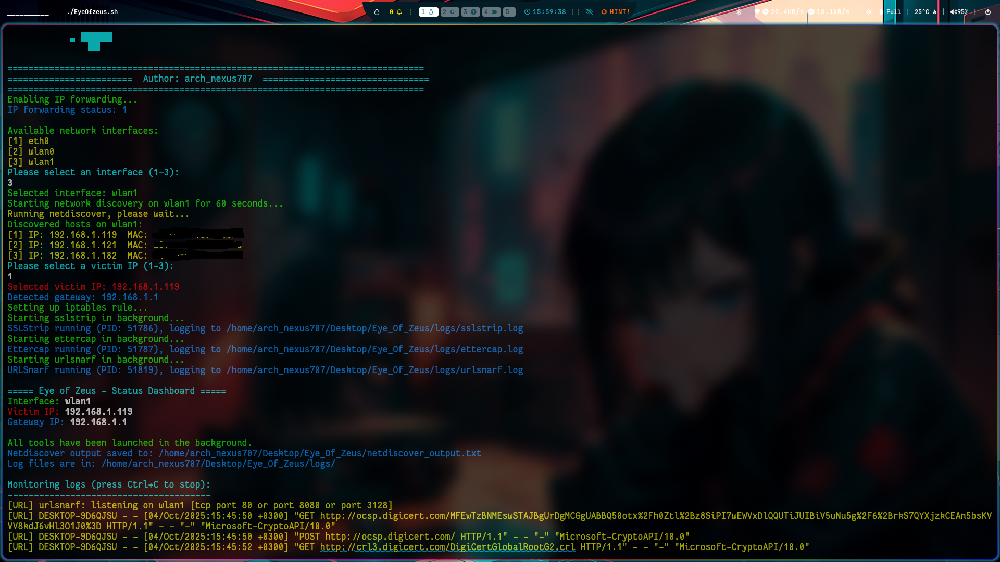

# Eye Of Zeus

A powerful network reconnaissance and man-in-the-middle attack tool for ethical hacking and penetration testing.



## Features

- Network discovery and host enumeration
- ARP poisoning attacks
- SSL stripping for HTTPS interception
- URL capturing and monitoring
- Automated iptables configuration
- Hyprland/Wayland compatible

## Prerequisites

- Kali Linux or similar penetration testing distribution
- The following tools installed:
  - netdiscover
  - sslstrip
  - ettercap
  - urlsnarf

## Installation

1. Clone this repository:
```bash
git clone https://github.com/dkhacker707/Eye_Of_Zeus.git
cd Eye_Of_Zeus